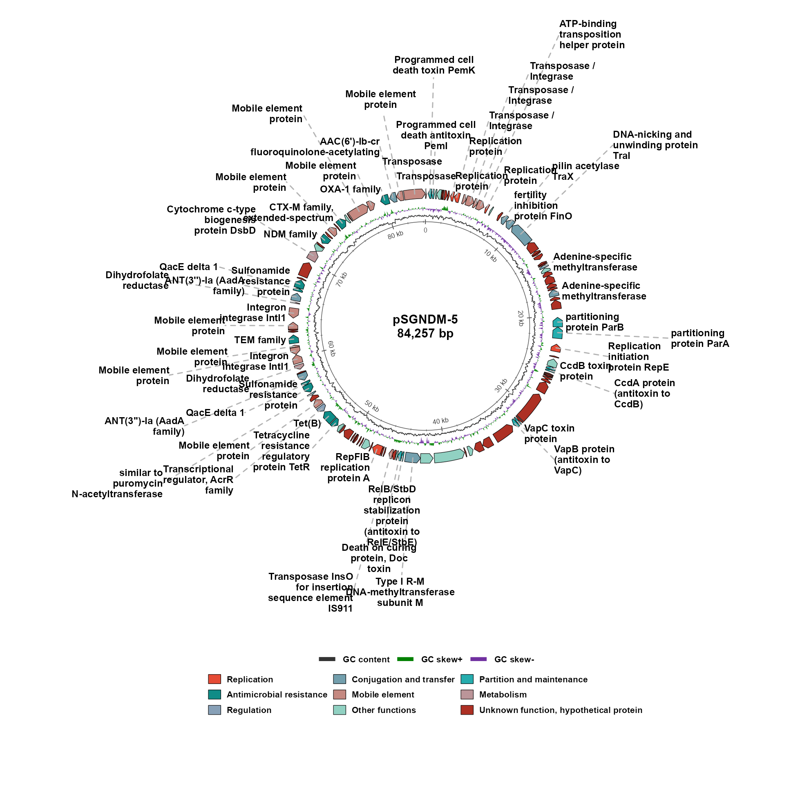
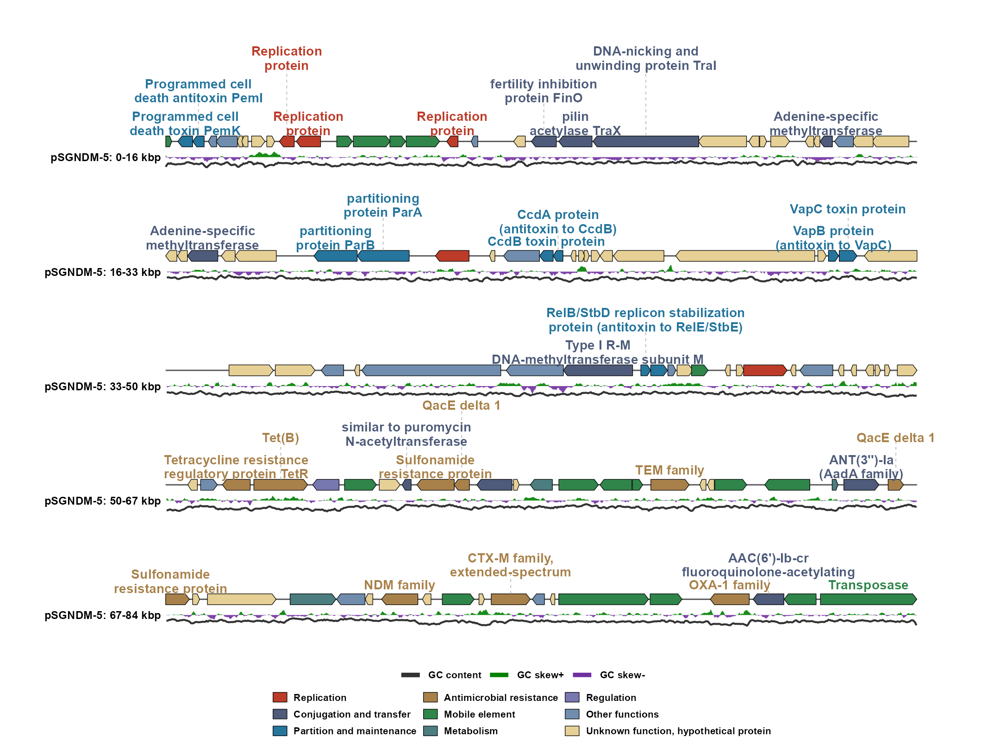

# ggplasmidZY

`ggplasmidZY` is an R package for creating publication-quality genetic maps of
plasmids and bacteriophages. Built within the `ggplot2` framework, it supports
both circular and linear visualization of annotated genetic features.

The package provides automated label placement to minimize label overlap,
together with flexible user-defined controls for label positions, connector
lines, text wrapping, and label selection. These features are useful for
densely annotated plasmids, including plasmids carrying multiple
antimicrobial-resistance genes, mobile genetic elements, and other genomic
features of interest.

For bacteriophage genomes, `ggplasmidZY` supports both circular and linear maps
and provides an optional terminal-boundary marker when a linear genome is
displayed using a circular layout. The package also supports named color
palettes from `ggsci`.

The main plotting function is `ggplasmid()`. It returns a standard `ggplot`
object, allowing users to add additional layers, themes, titles, and scales
using conventional `ggplot2` syntax.

## Installation

Install `ggplasmidZY` directly from GitHub:

```r
install.packages("remotes")
remotes::install_github("yzhong005/ggplasmidZY")

library(ggplasmidZY)
```

The required dependencies, including `ggplot2` and `ggsci`, are installed
automatically when needed.

## Quick start

The package includes an example dataset derived from the publicly available
pSGNDM-5 plasmid sequence. The pSGNDM-5 reference plasmid is 84,257 bp in
length and was described by Zhong et al. in *JAC-Antimicrobial Resistance*
(2022;4(4):dlac071). [10.1093/jacamr/dlac071](https://doi.org/10.1093/jacamr/dlac071).

Run the following code to load the example GenBank annotation:

```r
library(ggplasmidZY)

gbk_file <- system.file("extdata", "pSGNDM_5.gbk", package = "ggplasmidZY")

annotation <- read_plasmid_annotation(gbk = gbk_file) # annotation + ORIGIN sequence
```

The returned object contains both the annotated genomic features and the
sequence extracted from the GenBank `ORIGIN` field.

To visualize your own plasmid or bacteriophage genome, replace the example file
with your GenBank file:

```r
annotation <- read_gbk("path/to/your_genome.gbk")
```

### Circular map

Use the example dataset included with the package to generate a circular
plasmid map:

```r
p_circular <- ggplasmid(
  annotation = annotation,                    # gene features and ORIGIN sequence
  name = "pSGNDM-5",                          # plot title/name
  layout = "circular",                        # circular map
  palette = "lancet",                         # any named ggsci palette
  gene_highlight = gene_highlight(
    "Unknown function, hypothetical protein" = "grey30"
  ),                                         # highlight unknown-function arrows
  label_exclude_categories = "Other functions", # hide these labels only
  label_anchor_radius = 1.07,                  # start labels close to the gene ring
  label_line_length = 0.04,                    # small initial connector gap
  gene_height = 0.14,                          # thicker gene arrows
  label_text_size = 4.0,                       # larger bold labels
  label_linewidth = 0.55,                      # thicker label connectors
  label_line_colour = "grey70",               # light-gray leader lines
  label_line_linetype = "dashed",             # dashed leader lines
  label_text_colour = "category",             # label text color by category
  legend_position = "bottom"                  # put legends below the map
)

p_circular
```



### Linear map with default connector direction

This is the recommended starting layout for a linear map. It displays the
genome across five lines, uses horizontal label text, and applies the default
vertical connector direction.

```r
p_linear <- ggplasmid(
  annotation = annotation,                    # gene features and ORIGIN sequence
  name = "pSGNDM-5",                          # plot title/name
  layout = "linear",                          # linear map
  palette = "nejm",                           # any named ggsci palette
  plot_line_num = 5,                           # number of genome lines
  max_labels = 36,                             # maximum labels to draw
  linear_label_wrap_width = 18,                # approximate label width
  linear_label_max_lines = 2,                  # use no more than two text lines per label
  linear_row_spacing = 4.0,                    # gap between genome lines
  linear_label_allow_gene_line_crossing = FALSE, # prevent connectors from crossing genome and GC tracks
  linear_label_offset = 0.14,                  # keep two-line labels clear of arrows
  label_text_angle = 0,                        # keep label text horizontal
  gc_skew_height = 0.28,                       # taller GC-skew track
  gc_content_height = 0.14,                    # taller GC-content track
  gc_content_linewidth = 0.8,                  # thicker GC-content line
  label_text_colour = "category",             # label text color by category
  label_line_colour = "grey70",               # fixed leader-line color
  legend_position = "bottom",                 # put legends below the map
  legend_columns = 3,                           # compact feature legend row
  gc_legend_columns = 3                         # compact GC legend row
)

p_linear
```



The quick-start examples above use the packaged GenBank sequence directly.
The underlying data associated with an existing plot can be retrieved using
`plasmid_data(p)`. Set
`label_unknown = TRUE` to include unknown or hypothetical gene labels.

You can also display a selected region of a plasmid or bacteriophage genome.
Set `region_start` and `region_end` using 1-based inclusive coordinates.
Features and sequence-derived GC tracks are clipped to the selected region,
and coordinates are rebased relative to the beginning of that region. The
[linear-map wiki page](https://github.com/yzhong005/ggplasmidZY/wiki/Linear-map)
shows this together with the two-sided linear-label option.

## Label control

For detailed information on circular and linear label placement, manual
adjustments, label wrapping, and omitted-label summaries, see the
[label-control wiki page](https://github.com/yzhong005/ggplasmidZY/wiki/Label-control).

For a final manual correction, use the single-label form of `label_adjust()` to
reposition an individual label and its connector. Linear maps can target a
`gene_id`; circular maps can use the full label text.

```r
p_linear_adjusted <- ggplasmid(
  annotation = annotation,
  name = "pSGNDM-5",
  layout = "linear",
  plot_line_num = 4,
  label_adjust = label_adjust(
    "tetR",
    hjust = 0.20,
    vjust = 0.10
  )
)

p_linear_adjusted
```

`label_adjust()` also accepts a data frame or named list when multiple labels
require manual adjustment; see the
[label-control wiki page](https://github.com/yzhong005/ggplasmidZY/wiki/Label-control).

## Annotation table input

The annotation table must contain, at minimum, start and end coordinates for
each feature. A `category` column is recommended because it determines
feature-arrow colors and can also control label-text colors when
`label_text_colour = "category"`. Alternative annotation column names are
supported through automatic column detection. If no category column is
supplied, `ggplasmid()` attempts to infer feature categories from the feature
labels and feature types.

For annotation-table input, provide a FASTA file when sequence-derived GC
content and GC skew are required. A separate FASTA file is not required for
GenBank input because the sequence is extracted directly from the `ORIGIN`
field.

Common column names are detected automatically:

- Coordinates: `start`/`begin`/`from`/`left` and `end`/`stop`/`to`/`right`
- Strand: `strand`/`frame`/`direction`
- Label text: `label`/`product`/`annot`/`annotation`/`function`/`gene`/`name`/`note`
- Feature category: `category`/`group`/`pharokka_category`/`function_category`/`class`
- Label and connector colors: user-specified columns containing valid R color values
- Feature type: `type`/`feature`/`region`

```r
features <- data.frame(
  start = c(100, 1700, 3300),
  end = c(900, 2700, 4200),
  strand = c("+", "-", "+"),
  product = c("replication protein", "mobilization protein", "beta-lactamase"),
  category = c("Replication", "Mobile element", "Antimicrobial resistance"),
  label_colour = c("#2166AC", "#8B4513", "#B2182B"),
  line_colour = c("#2166AC", "#8B4513", "#B2182B")
)

# This packaged FASTA keeps the public example reproducible.
# Replace it with read_fasta("path/to/your_genome.fasta") for your own table.
fasta <- read_fasta(
  system.file("extdata", "pSGNDM_5.fasta", package = "ggplasmidZY")
)

ggplasmid(
  features,
  fasta = fasta,
  genome_length = fasta$length[[1]],
  name = "pExample",
  label_text_colour = "label_colour", # use a table color column
  label_line_colour = "line_colour"    # use a table color column
)
```

The `category` column defines feature classes and determines how colors from
the selected `palette` are assigned. Setting `label_text_colour = "category"`
applies the corresponding feature-category colors to the label text.
`gene_highlight()` assigns custom fill colors to selected gene arrows, whereas
label-text and connector colors are controlled separately using
`label_text_colour` and `label_line_colour`. When
`label_text_colour = "category"`, label text uses the final color assigned to
each feature, including colors applied through `gene_highlight()`. For custom
label text and leader-line colors, use columns containing valid R colors:

```r
ggplasmid(
  features,
  genome_length = 5000,
  name = "pExample",
  label_text_colour = "label_colour",
  label_line_colour = "line_colour"
)
```

You can also keep color choices in a separate data frame:

`gene_highlight()` accepts either named color values or a two-column data frame
containing feature categories and their corresponding colors.

```r
my_colors <- data.frame(
  category = c("Antimicrobial resistance", "Replication"),
  color = c("#B2182B", "#2166AC")
)

ggplasmid(
  features,
  genome_length = 5000,
  name = "pExample",
  gene_highlight = gene_highlight(my_colors)
)
```

## Styling

Most plot-geometry and text parameters have default values but can be adjusted directly:

```r
ggplasmid(
  annotation = annotation,
  name = "pSGNDM-5",
  palette = "npg", # any named ggsci palette
  gene_highlight = gene_highlight(
    "Antimicrobial resistance" = "#B2182B",
    "Replication" = "#2166AC"
  ),
  gene_border_linewidth = 0.35,     # outline width around gene arrows
  gene_arrow_head_fraction = 0.45,  # max arrow-head fraction of each feature
  inner_radius = 0.30,              # center hole size for circular layout
  gc_skew_radius = 0.80,            # distance from center to GC-skew ring
  gc_content_radius = 0.68,         # distance from center to GC-content line
  gc_content_linewidth = 0.35,      # GC-content line width
  gc_legend_linewidth = 1.6,        # GC legend line thickness
  ruler_linewidth = 0.30,           # bp ruler circle/tick width
  label_text_size = 3.4,            # label font size
  label_anchor_radius = 1.12,       # starting distance for outside labels
  label_text_colour = "black",      # or an annotation-table color column
  label_line_colour = "grey70",     # leader line color
  label_line_linetype = "dashed",   # leader line style
  legend_position = "bottom",       # outside legend: "top", "bottom", "left", or "right"
  legend_columns = 3,               # top/bottom feature legends default to 3 columns
  gc_legend_columns = 3             # top/bottom GC legend: 3 gives one row
)
```

`palette` chooses the `ggsci` color palette used for the gene categories. The
package accepts every exported `ggsci::pal_*` palette, including `"npg"`,
`"aaas"`, `"lancet"`, `"jco"`, `"locuszoom"`, and `"futurama"`. To list all
palette names available in your installed `ggsci` version, run:

```r
sort(sub("^pal_", "", getNamespaceExports("ggsci")[
  grepl("^pal_", getNamespaceExports("ggsci"))
]))
```

Use `ggplasmid_colors()` to inspect the built-in feature-category names and
color mapping. It is not required to choose a palette or create a plot. In
circular layouts, arguments ending in `_radius` specify the radial distance
from the plot center to the corresponding track or element.

You can also add highlights after creating the plot:

```r
p <- ggplasmid(
  annotation = annotation,
  name = "pSGNDM-5",
  palette = "npg"
)

p + gene_highlight(
  "Antimicrobial resistance" = "#B2182B",
  "Replication" = "#2166AC"
)
```

For a right-side legend, keep it vertical or use two compact columns:

```r
ggplasmid(
  annotation = annotation,
  name = "pSGNDM-5",
  legend_position = "right",
  legend_columns = 2,
  gc_legend_columns = 1
)
```

Corner legend positions (`"left_top"`, `"right_top"`, `"left_bottom"`, and
`"right_bottom"`) place both one-column legends in the matching upper or lower
outer band without consuming the map's horizontal plotting width and use
compact key/text spacing to preserve the circular map area. Top and bottom
legends default to three feature columns and one GC legend row; set
`legend_columns` or `gc_legend_columns` explicitly when you want a different
layout.

The object returned by `read_plasmid_fasta()` includes a `fasta` column
containing the sequence in FASTA-formatted text:

```r
fasta <- read_plasmid_fasta("genome.fasta")
fasta$fasta[[1]]
format_plasmid_fasta(fasta, width = 70)
```

For table input, use `read_annotation_table()` when you want the table reader
directly:

```r
annotation_data <- read_annotation_table("features.tsv")
```

## Bacteriophage maps

Use `plot_phage_map()` to generate a bacteriophage genome map using the
package's phage-specific feature classifications and color scheme:

```r
plot_phage_map(
  gbk = "phage.gbk",
  layout = "circular",
  phage_topology = "linear"
)
```

The `phage_topology = "linear"` option affects only the circular layout. It
adds a terminal-boundary marker at the point where the linear genome is
represented as a circular display. It does not convert the visualization into
a linear map.
