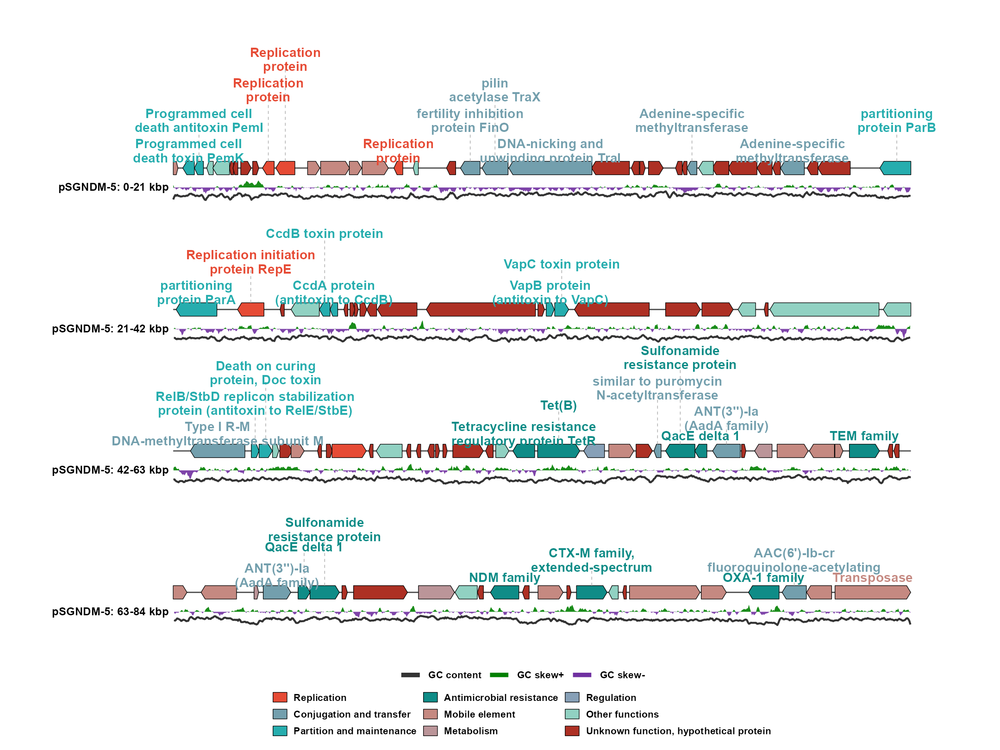

# ggplasmidZY

`ggplasmidZY` is an R package for generating publication-quality genetic maps,
with particular suitability for plasmids and bacteriophages. Built entirely
within the `ggplot2` framework, it supports both circular and linear plotting of
annotated genetic features. Its intelligent label-placement algorithm
automatically minimizes label overlap, making it particularly effective for
dense multidrug-resistant plasmids containing numerous resistance genes, mobile
genetic elements, and other features requiring labels. It can also plot circular
or linear maps for bacteriophage genomes, including a terminal marker option for
linear phage genomes. The package supports named color palettes from `ggsci`.

The main function is `ggplasmid()`. It returns a normal `ggplot` object, so you
can add ggplot layers, themes, titles, and scales.

## Install

Install the package directly from GitHub:

```r
install.packages("remotes")
remotes::install_github("yzhong005/ggplasmidZY")

library(ggplasmidZY)
```

`ggplot2` and `ggsci` are installed automatically as package
dependencies when needed.

## Quick start

The package includes a public pSGNDM-5 plasmid example. Copy this block into
RStudio to load the example data:

This public pSGNDM-5 reference plasmid is 84,257 bp long. The source is Zhong
Y, Guo S, Schlundt J, Kwa AL. *JAC-Antimicrobial Resistance*. 2022;4(4):dlac071.
[10.1093/jacamr/dlac071](https://doi.org/10.1093/jacamr/dlac071).

```r
library(ggplasmidZY)

gbk_file <- system.file("extdata", "pSGNDM_5.gbk", package = "ggplasmidZY")

annotation <- read_plasmid_annotation(gbk = gbk_file) # annotation + ORIGIN sequence
```

To plot your own plasmid or phage, replace the example annotation with:

```r
annotation <- read_gbk("path/to/your_genome.gbk")
```

### Circular map

Use the packaged system example to plot a circular plasmid map:

```r
p_circular <- ggplasmid(
  annotation = annotation,                    # gene features and ORIGIN sequence
  name = "pSGNDM-5",                          # plot title/name
  layout = "circular",                        # circular map
  palette = "lancet",                         # ggsci palette; supported: "npg", "aaas", "lancet", "jco", "ucscgb", "d3", "igv"
  gene_highlight = gene_highlight(
    "Unknown function, hypothetical protein" = "grey30"
  ),                                         # highlight unknown-function arrows
  label_exclude_categories = "Other functions", # hide these labels only
  label_anchor_radius = 1.07,                  # start labels close to the gene ring
  label_line_length = 0.04,                    # small initial connector gap
  gene_height = 0.14,                          # thicker gene arrows
  label_text_size = 4.0,                       # larger bold labels
  label_linewidth = 0.55,                      # thicker label connectors
  label_line_colour = "grey70",               # light-gray leader lines
  label_line_linetype = "dashed",             # dashed leader lines
  label_text_colour = "category",             # label text color by category
  legend_position = "bottom"                  # put legends below the map
)

p_circular
```


### Linear map with default connector direction

This is the recommended starting layout. It uses four genome lines and
horizontal label text. The default vertical connector direction is used for
this demo.

```r
p_linear <- ggplasmid(
  annotation = annotation,                    # gene features and ORIGIN sequence
  name = "pSGNDM-5",                          # plot title/name
  layout = "linear",                          # linear map
  palette = "npg",                            # ggsci palette; supported: "npg", "aaas", "lancet", "jco", "ucscgb", "d3", "igv"
  plot_line_num = 4,                           # number of genome lines
  max_labels = 36,                             # maximum labels to draw
  linear_label_wrap_width = 18,                # approximate label width
  linear_label_max_lines = 2,                  # never use more than two rows
  linear_row_spacing = 4.0,                    # gap between genome lines
  linear_label_allow_gene_line_crossing = FALSE, # protect line and GC tracks above
  linear_label_offset = 0.14,                  # keep two-line labels clear of arrows
  label_text_angle = 0,                        # keep label text horizontal
  gc_skew_height = 0.28,                       # taller GC-skew track
  gc_content_height = 0.14,                    # taller GC-content track
  gc_content_linewidth = 0.8,                  # thicker GC-content line
  label_text_colour = "category",             # label text color by category
  label_line_colour = "grey70",               # fixed leader-line colour
  legend_position = "bottom",                 # put legends below the map
  legend_columns = 3,                           # compact feature legend row
  gc_legend_columns = 3                         # compact GC legend row
)

p_linear
```



The quick-start examples above use the packaged GenBank sequence directly.
The data used by an existing plot can be retrieved with `plasmid_data(p)`. Set
`label_unknown = TRUE` to include unknown or hypothetical gene labels.

You can also display only a selected part of a plasmid or phage. Set the
1-based inclusive `region_start` and `region_end` coordinates; features and
sequence-derived GC tracks are clipped and rebased to that window. The
[linear-map wiki page](https://github.com/yzhong005/ggplasmidZY/wiki/Linear-map)
shows this together with the two-sided linear-label option.

## Label control

For detailed circular and linear label placement, manual adjustments, label
wrapping, and omitted-label summaries, see the
[Label control Wiki page](https://github.com/yzhong005/ggplasmidZY/wiki/Label-control).

For a final small correction, move one selected label and its connector with
`label_adjust`. Linear maps use `gene_id`; circular maps can use the full label
text.

```r
linear_adjustments <- data.frame(
  gene_id = "tetR",
  hjust = 0.20,
  vjust = 0.10
)

p_linear_adjusted <- ggplasmid(
  annotation = annotation,
  name = "pSGNDM-5",
  layout = "linear",
  plot_line_num = 4,
  label_adjust = linear_adjustments
)

p_linear_adjusted
```

## Annotation Table Input

The table needs at least start and end coordinates. A `category` column is
recommended because it controls feature-arrow colors and, when
`label_text_colour = "category"`, can also control label text colors. Other
annotation column names are accepted through the package's automatic column
detection. If no category column is supplied, `ggplasmid` will try to infer a
category from the feature label and type.

For annotation-table input, pass a FASTA file when you want sequence-derived
GC content and GC skew. A GenBank input does not need a separate FASTA because
its `ORIGIN` sequence is used directly.

Common column names are detected automatically:

- Coordinates: `start`/`begin`/`from`/`left` and `end`/`stop`/`to`/`right`
- Strand: `strand`/`frame`/`direction`
- Label text: `label`/`product`/`annot`/`annotation`/`function`/`gene`/`name`/`note`
- Category for colors: `category`/`group`/`pharokka_category`/`function_category`/`class`
- Label text/line colours: any additional columns containing valid R colours
- Feature type: `type`/`feature`/`region`

```r
features <- data.frame(
  start = c(100, 1700, 3300),
  end = c(900, 2700, 4200),
  strand = c("+", "-", "+"),
  product = c("replication protein", "mobilization protein", "beta-lactamase"),
  category = c("Replication", "Mobile element", "Antimicrobial resistance"),
  label_colour = c("#2166AC", "#8B4513", "#B2182B"),
  line_colour = c("#2166AC", "#8B4513", "#B2182B")
)

# This packaged FASTA keeps the public example reproducible.
# Replace it with read_fasta("path/to/your_genome.fasta") for your own table.
fasta <- read_fasta(
  system.file("extdata", "pSGNDM_5.fasta", package = "ggplasmidZY")
)

ggplasmid(
  features,
  fasta = fasta,
  genome_length = fasta$length[[1]],
  name = "pExample",
  label_text_colour = "label_colour", # use a table colour column
  label_line_colour = "line_colour"    # use a table colour column
)
```

`category` controls feature-arrow classification and the selected `palette`.
Using `label_text_colour = "category"` applies the category colors to label
text. `gene_highlight()` sets selected gene-arrow fill colors; label colors are
controlled separately by `label_text_colour` and `label_line_colour`. When
`label_text_colour = "category"`, label text follows the feature/category
colors, including highlighted categories. For custom label text and leader-line
colors, use columns containing valid R colors:

```r
ggplasmid(
  features,
  genome_length = 5000,
  name = "pExample",
  label_text_colour = "label_colour",
  label_line_colour = "line_colour"
)
```

You can also keep color choices in a separate data frame:

```r
my_colors <- data.frame(
  category = c("Antimicrobial resistance", "Replication"),
  color = c("#B2182B", "#2166AC")
)

ggplasmid(
  features,
  genome_length = 5000,
  name = "pExample",
  gene_highlight = gene_highlight(my_colors),
  label_text_colour = "label_colour",
  label_line_colour = "line_colour"
)
```

## Styling

Most plot geometry and text settings have defaults but can be tuned directly:

```r
ggplasmid(
  annotation = annotation,
  name = "pSGNDM-5",
  palette = "npg", # ggsci palette; supported: "npg", "aaas", "lancet", "jco", "ucscgb", "d3", "igv"
  gene_highlight = gene_highlight(
    "Antimicrobial resistance" = "#B2182B",
    "Replication" = "#2166AC"
  ),
  gene_border_linewidth = 0.35,     # outline width around gene arrows
  gene_arrow_head_fraction = 0.45,  # max arrow-head fraction of each feature
  inner_radius = 0.30,              # center hole size for circular layout
  gc_skew_radius = 0.80,            # distance from center to GC-skew ring
  gc_content_radius = 0.68,         # distance from center to GC-content line
  gc_content_linewidth = 0.35,      # GC-content line width
  gc_legend_linewidth = 1.6,        # GC legend line thickness
  ruler_linewidth = 0.30,           # bp ruler circle/tick width
  label_text_size = 3.4,            # label font size
  label_anchor_radius = 1.12,       # starting distance for outside labels
  label_text_colour = "black",      # or an annotation-table colour column
  label_line_colour = "grey70",     # leader line color
  label_line_linetype = "dashed",   # leader line style
  legend_position = "bottom",       # "right", "bottom", "left", "top", or "none"
  legend_columns = 3,               # feature-color legend columns
  gc_legend_columns = 3             # GC legend columns; 3 gives one row
)
```

`palette` accepts the ggsci palette names `"npg"`, `"aaas"`, `"lancet"`,
`"jco"`, `"ucscgb"`, `"d3"`, and `"igv"`. Use `ggplasmid_colors()` only when
you want to inspect the built-in category names; `gene_highlight()` can also
use the category values in your own annotation table. Circular `*_radius` settings
are distances from the center of the plot to that ring.

You can also add highlights after creating the plot:

```r
p <- ggplasmid(
  annotation = annotation,
  name = "pSGNDM-5",
  palette = "npg"
)

p + gene_highlight(
  "Antimicrobial resistance" = "#B2182B",
  "Replication" = "#2166AC"
)
```

For a right-side legend, keep it vertical or use two compact columns:

```r
ggplasmid(
  annotation = annotation,
  name = "pSGNDM-5",
  legend_position = "right",
  legend_columns = 2,
  gc_legend_columns = 1
)
```

`read_plasmid_fasta()` also includes a FASTA-formatted text column:

```r
fasta <- read_plasmid_fasta("genome.fasta")
fasta$fasta[[1]]
format_plasmid_fasta(fasta, width = 70)
```

For table input, use `read_annotation_table()` when you want the table reader
directly:

```r
annotation_data <- read_annotation_table("features.tsv")
```

## Phage Wrapper

For a phage map, use the phage color/classification scheme:

```r
plot_phage_map(
  gbk = "phage.gbk",
  layout = "circular",
  phage_topology = "linear"
)
```

`phage_topology = "linear"` only affects circular layout. It adds a terminal
boundary line at the genome break point. It does not change the map into a
linear plot.
