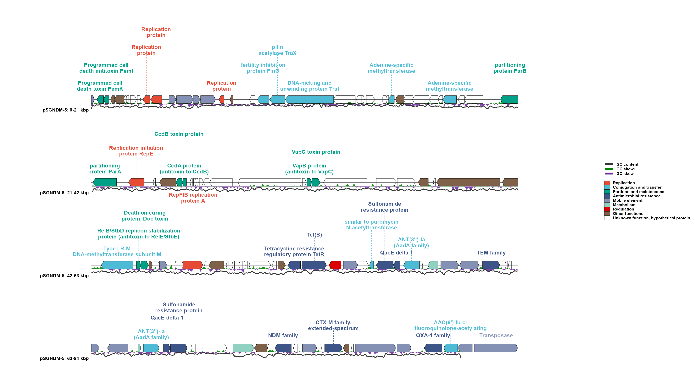

# ggplasmidZY

`ggplasmidZY` is an R package for generating publication-quality genetic maps,
with particular suitability for plasmids and bacteriophages. Built entirely
within the `ggplot2` framework, it supports both circular and linear plotting of
annotated genetic features. Its intelligent label-placement algorithm
automatically minimizes label overlap, making it particularly effective for
dense multidrug-resistant plasmids containing numerous resistance genes, mobile
genetic elements, and other features requiring labels. It can also plot circular
or linear maps for bacteriophage genomes, including a terminal marker option for
linear phage genomes. The package provides a curated catalogue of color
palettes for genetic features and labels, and supports palettes from `ggsci`.

The main function is `ggplasmid()`. It returns a normal `ggplot` object, so you
can add ggplot layers, themes, titles, and scales.

## Install

Install the package directly from GitHub:

```r
install.packages("remotes")
remotes::install_github("yzhong005/ggplasmidZY")

library(ggplasmidZY)
```

`ggplot2` and `ggsci` are installed automatically as package
dependencies when needed.

## Quick start

The package includes a public pSGNDM-5 plasmid example. Copy this block into
RStudio to load the example data:

This public pSGNDM-5 reference plasmid is 84,257 bp long. The source is Zhong
Y, Guo S, Schlundt J, Kwa AL. *JAC-Antimicrobial Resistance*. 2022;4(4):dlac071.
[10.1093/jacamr/dlac071](https://doi.org/10.1093/jacamr/dlac071).

```r
library(ggplasmidZY)

gbk_file <- system.file("extdata", "pSGNDM_5.gbk", package = "ggplasmidZY")
fasta_file <- system.file("extdata", "pSGNDM_5.fasta", package = "ggplasmidZY")

annotation <- read_plasmid_annotation(gbk = gbk_file) # parsed gene annotation
fasta <- read_plasmid_fasta(fasta_file)              # genome sequence
```

### Circular map

```r
p_circular <- ggplasmid(
  annotation = annotation,                    # gene features
  fasta = fasta,                              # sequence for GC tracks
  name = "pSGNDM-5",                          # plot title/name
  layout = "circular",                        # circular map
  label_exclude_categories = "Other functions", # hide these labels only
  max_labels = 24,                             # maximum labels to draw
  label_text_colour = "category",             # color label text by category
  label_line_colour = "category",             # color leader lines by category
  legend_position = "right"                   # put legends beside the map
)

p_circular
```


### Linear map with default connector direction

This is the recommended starting layout. It uses four genome lines and
horizontal label text. Leaving `label_line_angle` out uses the default vertical
connector direction.

```r
p_linear <- ggplasmid(
  annotation = annotation,                    # gene features
  fasta = fasta,                              # sequence for GC tracks
  name = "pSGNDM-5",                          # plot title/name
  layout = "linear",                          # linear map
  plot_line_num = 4,                           # number of genome lines
  max_labels = 36,                             # maximum labels to draw
  linear_label_wrap_width = 18,                # approximate label width
  linear_label_max_lines = 2,                  # never use more than two rows
  linear_row_spacing = 4.0,                    # gap between genome lines
  linear_label_allow_gene_line_crossing = FALSE, # protect line above
  label_text_angle = 0,                        # keep label text horizontal
  gc_skew_height = 0.28,                       # taller GC-skew track
  gc_content_height = 0.14,                    # taller GC-content track
  gc_content_linewidth = 0.8,                  # thicker GC-content line
  gc_legend_columns = 1,                       # compact GC legend
  label_text_colour = "category",             # color label text by category
  label_line_colour = "category",             # color leader lines by category
  legend_position = "right"                   # put legends beside the map
)

p_linear
```



The quick-start examples above use the packaged GenBank and FASTA files. The
parsed data are available as `annotation` and `fasta`, and the data used by an
existing plot can be retrieved with `plasmid_data(p)`. Set
`label_unknown = TRUE` to include unknown or hypothetical gene labels.

## Label control

For detailed circular and linear label placement, manual adjustments, label
wrapping, and omitted-label summaries, see the
[Label control Wiki page](https://github.com/yzhong005/ggplasmidZY/wiki/Label-control).

## Your Own GenBank Input

```r
ggplasmid(
  gbk = "plasmid.gbk",
  fasta = "plasmid.fasta",
  name = "pExample",
  layout = "circular",
  output = "pExample_circular.png"
)
```

## Annotation Table Input

The table needs at least start and end coordinates. A `category` column is
recommended because it controls the feature color and, when requested, the
label color. If no category column is supplied, `ggplasmid` will try to infer a
category from the feature label and type.

Common column names are detected automatically:

- Coordinates: `start`/`begin`/`from`/`left` and `end`/`stop`/`to`/`right`
- Strand: `strand`/`frame`/`direction`
- Label text: `label`/`product`/`annot`/`annotation`/`function`/`gene`/`name`/`note`
- Category for colors: `category`/`group`/`pharokka_category`/`function_category`/`class`
- Feature type: `type`/`feature`/`region`

```r
features <- data.frame(
  start = c(100, 1700, 3300),
  end = c(900, 2700, 4200),
  strand = c("+", "-", "+"),
  product = c("replication protein", "mobilization protein", "beta-lactamase"),
  category = c("Replication", "Mobile element", "Antimicrobial resistance")
)

ggplasmid(
  features,
  genome_length = 5000,
  name = "pExample",
  label_text_colour = "category", # use the category column for label text colors
  label_line_colour = "category"  # use the category column for leader line colors
)
```

Use category names from `ggplasmid_colors("plasmid")` or
`ggplasmid_colors("phage")`. To manually change colors for selected categories,
pass `gene_highlight()` to `ggplasmid()`:

```r
ggplasmid(
  features,
  genome_length = 5000,
  name = "pExample",
  gene_highlight = gene_highlight(
    "Antimicrobial resistance" = "#B2182B",
    "Replication" = "#2166AC"
  ),
  label_text_colour = "category",
  label_line_colour = "category"
)
```

You can also keep color choices in a separate data frame:

```r
my_colors <- data.frame(
  category = c("Antimicrobial resistance", "Replication"),
  color = c("#B2182B", "#2166AC")
)

ggplasmid(
  features,
  genome_length = 5000,
  name = "pExample",
  gene_highlight = gene_highlight(my_colors)
)
```

## Styling

Most plot geometry and text settings have defaults but can be tuned directly:

```r
ggplasmid(
  annotation = gbk_data,
  fasta = fasta_data,
  name = "pSGNDM-5",
  palette = "npg", # ggsci palette; try "aaas", "lancet", "jco", "igv", etc.
  gene_highlight = gene_highlight(
    "Antimicrobial resistance" = "#B2182B",
    "Replication" = "#2166AC"
  ),
  gene_border_linewidth = 0.35,     # outline width around gene arrows
  gene_arrow_head_fraction = 0.45,  # max arrow-head fraction of each feature
  inner_radius = 0.30,              # center hole size for circular layout
  gc_skew_radius = 0.80,            # distance from center to GC-skew ring
  gc_content_radius = 0.68,         # distance from center to GC-content line
  gc_content_linewidth = 0.35,      # GC-content line width
  gc_legend_linewidth = 1.6,        # GC legend line thickness
  ruler_linewidth = 0.30,           # bp ruler circle/tick width
  label_text_size = 3.4,            # label font size
  label_anchor_radius = 1.12,       # starting distance for outside labels
  label_text_colour = "category",   # "category" or a fixed color such as "black"
  label_line_colour = "grey70",     # leader line color
  label_line_linetype = "dashed",   # leader line style
  legend_position = "bottom",       # "right", "bottom", "left", "top", or "none"
  legend_columns = 3,               # feature-color legend columns
  gc_legend_columns = 3             # GC legend columns; 3 gives one row
)
```

`gene_highlight` changes only the categories you name, and the remaining
categories keep the selected palette. You can also pass a data frame with
`category` and `color` columns. Circular `*_radius` settings are distances from
the center of the plot to that ring.

You can also add highlights after creating the plot:

```r
p <- ggplasmid(
  annotation = gbk_data,
  fasta = fasta_data,
  name = "pSGNDM-5",
  palette = "npg"
)

p + gene_highlight(
  "Antimicrobial resistance" = "#B2182B",
  "Replication" = "#2166AC"
)
```

For a right-side legend, keep it vertical or use two compact columns:

```r
ggplasmid(
  annotation = gbk_data,
  fasta = fasta_data,
  name = "pSGNDM-5",
  legend_position = "right",
  legend_columns = 2,
  gc_legend_columns = 1
)
```

`read_plasmid_fasta()` also includes a FASTA-formatted text column:

```r
fasta_data$fasta[[1]]
format_plasmid_fasta(fasta_data, width = 70)
```

For table input, use `read_annotation_table()` when you want the table reader
directly:

```r
annotation_data <- read_annotation_table("features.tsv")
```

## Phage Wrapper

For a phage map, use the phage color/classification scheme:

```r
plot_phage_map(
  gbk = "phage.gbk",
  layout = "circular",
  phage_topology = "linear"
)
```

`phage_topology = "linear"` only affects circular layout. It adds a terminal
boundary line at the genome break point. It does not change the map into a
linear plot.
