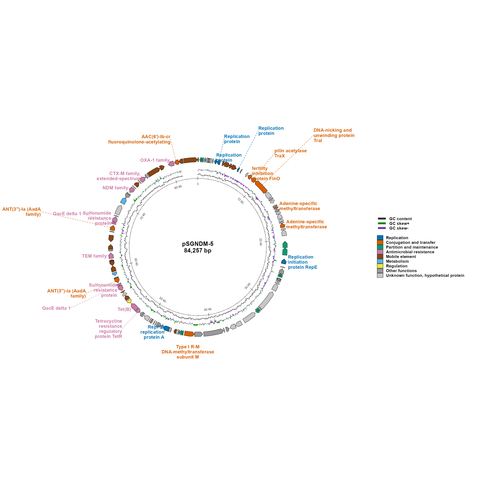

# ggplasmidZY

`ggplasmidZY` is an R package for generating publication-quality genetic maps,
with particular suitability for plasmids and bacteriophages. Built entirely
within the `ggplot2` framework, it supports both circular and linear plotting of
annotated genetic features. Its intelligent label-placement algorithm
automatically minimizes label overlap, making it particularly effective for
dense multidrug-resistant plasmids containing numerous resistance genes, mobile
genetic elements, and other features requiring labels. It can also plot circular
or linear maps for bacteriophage genomes, including a terminal marker option for
linear phage genomes. The package provides a curated catalogue of color
palettes for genetic features and labels, and supports palettes from `ggsci`.

The main function is `ggplasmid()`. It returns a normal `ggplot` object, so you
can add ggplot layers, themes, titles, and scales.

## Install

Install the package directly from GitHub:

```r
install.packages("remotes")
remotes::install_github("yzhong005/ggplasmid")

library(ggplasmidZY)
```

`ggplot2` and `ggsci` are installed automatically as package
dependencies when needed.

## pSGNDM-5 Demo

The package includes a real 84,257 bp pSGNDM-5 example plasmid:

- BioSample: SAMN18579051
- SRA project: SRP313016
- Plasmid: pSGNDM-5

Demo plasmid source: Zhong Y, Guo S, Schlundt J, Kwa AL. Identification
and genomic characterization of a blaNDM-5-harbouring MDR plasmid in a
carbapenem-resistant *Escherichia coli* ST410 strain isolated from a natural
water environmental source. *JAC-Antimicrobial Resistance*. 2022;4(4):dlac071.
doi: [10.1093/jacamr/dlac071](https://doi.org/10.1093/jacamr/dlac071).

```r
gbk_file <- system.file("extdata", "pSGNDM_5.gbk", package = "ggplasmidZY")
fasta_file <- system.file("extdata", "pSGNDM_5.fasta", package = "ggplasmidZY")

gbk_data <- read_gbk(gbk_file)
fasta_data <- read_fasta(fasta_file)

ggplasmid(
  annotation = gbk_data,
  fasta = fasta_data,
  name = "pSGNDM-5",
  layout = "circular",
  label_exclude_categories = "Other functions", # hide labels from this category only
  max_labels = Inf,                             # show all eligible non-Other labels
  label_wrap_width = 16,                        # wrap long labels after about 16 characters
  label_text_size = 3.0,                        # label font size
  label_anchor_radius = 1.12,                   # push labels a little away from the ring
  label_text_colour = "category",               # color label text by feature category
  label_line_colour = "grey70",                 # neutral grey leader lines
  label_line_linetype = "dashed",               # dashed leader lines
  legend_position = "bottom",                   # place legends below the map
  legend_columns = 3,                           # feature-color legend columns
  gc_legend_columns = 3,                        # GC legend in one row
  inner_radius = 0.30                           # smaller center hole leaves more label space
)

View(gbk_data)    # parsed GenBank feature data frame
View(fasta_data)  # FASTA record table with sequence and length
```



`gbk_data` is the parsed GenBank feature data frame. `fasta_data` is a data
frame with the FASTA record name, description, sequence, and length. The exact
data used by an existing plot can also be retrieved with `plasmid_data(p)`.

Use more labels while exploring:

```r
ggplasmid(
  annotation = gbk_data,
  fasta = fasta_data,
  name = "pSGNDM-5",
  layout = "circular",
  label_unknown = TRUE # also label unknown/hypothetical genes
)
```

Draw the same plasmid as a linear map:

```r
ggplasmid(
  annotation = gbk_data,
  fasta = fasta_data,
  name = "pSGNDM-5",
  layout = "linear",
  genome_line_num = 5, # number of genome lines in the linear map
  max_labels = 36 # label limit for the linear map
)
```

## Your Own GenBank Input

```r
ggplasmid(
  gbk = "plasmid.gbk",
  fasta = "plasmid.fasta",
  name = "pExample",
  layout = "circular",
  output = "pExample_circular.png"
)
```

## Annotation Table Input

The table needs at least start and end coordinates. A `category` column is
recommended because it controls the feature color and, when requested, the
label color. If no category column is supplied, `ggplasmid` will try to infer a
category from the feature label and type.

Common column names are detected automatically:

- Coordinates: `start`/`begin`/`from`/`left` and `end`/`stop`/`to`/`right`
- Strand: `strand`/`frame`/`direction`
- Label text: `label`/`product`/`annot`/`annotation`/`function`/`gene`/`name`/`note`
- Category for colors: `category`/`group`/`pharokka_category`/`function_category`/`class`
- Feature type: `type`/`feature`/`region`

```r
features <- data.frame(
  start = c(100, 1700, 3300),
  end = c(900, 2700, 4200),
  strand = c("+", "-", "+"),
  product = c("replication protein", "mobilization protein", "beta-lactamase"),
  category = c("Replication", "Mobile element", "Antimicrobial resistance")
)

ggplasmid(
  features,
  genome_length = 5000,
  name = "pExample",
  label_text_colour = "category", # use the category column for label text colors
  label_line_colour = "category"  # use the category column for leader line colors
)
```

Use category names from `ggplasmid_colors("plasmid")` or
`ggplasmid_colors("phage")`. To manually change colors for selected categories,
pass `gene_highlight()` to `ggplasmid()`:

```r
ggplasmid(
  features,
  genome_length = 5000,
  name = "pExample",
  gene_highlight = gene_highlight(
    "Antimicrobial resistance" = "#B2182B",
    "Replication" = "#2166AC"
  ),
  label_text_colour = "category",
  label_line_colour = "category"
)
```

You can also keep color choices in a separate data frame:

```r
my_colors <- data.frame(
  category = c("Antimicrobial resistance", "Replication"),
  color = c("#B2182B", "#2166AC")
)

ggplasmid(
  features,
  genome_length = 5000,
  name = "pExample",
  gene_highlight = gene_highlight(my_colors)
)
```

## Label Control

Circular plasmids can contain too many features for every label to be readable.
The default circular map considers all eligible non-hypothetical labels, sorts
them from shorter to longer text, and places them on radial outside lanes.
Crowded labels are moved to farther outer lanes with leader lines. Very dense
maps may still need a larger output size, smaller `label_text_size`, wider
`label_wrap_width`, or a finite `max_labels`.
`max_labels` limits only the number of labels; it does not affect how many gene
arrows are shown. Hypothetical/unknown genes still have their own grey color
category, but their text labels are omitted unless `label_unknown = TRUE`.

```r
ggplasmid(annotation = gbk_data, fasta = fasta_data,
          name = "pSGNDM-5", max_labels = Inf)
ggplasmid(annotation = gbk_data, fasta = fasta_data,
          name = "pSGNDM-5",
          label_pattern = "NDM|CTX|OXA|TEM|Tra|Rep")
ggplasmid(annotation = gbk_data, fasta = fasta_data,
          name = "pSGNDM-5",
          max_labels = 20,
          label_min_gap_deg = 8)
ggplasmid(annotation = gbk_data, fasta = fasta_data,
          name = "pSGNDM-5", show_labels = FALSE)
```

Fine-tune one or a few labels after automatic placement:

```r
ggplasmid(
  annotation = gbk_data,
  fasta = fasta_data,
  name = "pSGNDM-5",
  label_adjust = label_adjust(
    label = "RelB/StbD replicon stabilization protein (antitoxin to RelE/StbE)",
    hjust = 0.02,  # positive moves the label right
    vjust = -0.03  # positive moves the label up
  )
)
```

The same adjustment can be supplied as a data frame or list:

```r
label_adjust_df <- data.frame(
  label = c("RelB/StbD replicon stabilization protein (antitoxin to RelE/StbE)"),
  hjust = c(0.02),
  vjust = c(-0.03)
)

ggplasmid(annotation = gbk_data, fasta = fasta_data,
          name = "pSGNDM-5",
          label_adjust = label_adjust_df)

ggplasmid(annotation = gbk_data, fasta = fasta_data,
          name = "pSGNDM-5",
          label_adjust = list(label = "RelB/StbD replicon stabilization protein (antitoxin to RelE/StbE)",
                              hjust = 0.02,
                              vjust = -0.03))
```

If Windows reports a font database warning, keep the default portable font or
choose an installed family:

```r
ggplasmid(annotation = gbk_data, fasta = fasta_data,
          name = "pSGNDM-5", font_family = "sans")
ggplasmid(annotation = gbk_data, fasta = fasta_data,
          name = "pSGNDM-5",
          font_family = "Times New Roman")
```

## Styling

Most plot geometry and text settings have defaults but can be tuned directly:

```r
ggplasmid(
  annotation = gbk_data,
  fasta = fasta_data,
  name = "pSGNDM-5",
  palette = "npg", # ggsci palette; try "aaas", "lancet", "jco", "igv", etc.
  gene_highlight = gene_highlight(
    "Antimicrobial resistance" = "#B2182B",
    "Replication" = "#2166AC"
  ),
  gene_border_linewidth = 0.35,     # outline width around gene arrows
  gene_arrow_head_fraction = 0.45,  # arrow-head length as a fraction of gene height
  inner_radius = 0.30,              # center hole size for circular layout
  gc_skew_radius = 0.80,            # distance from center to GC-skew ring
  gc_content_radius = 0.68,         # distance from center to GC-content line
  gc_content_linewidth = 0.35,      # GC-content line width
  gc_legend_linewidth = 1.6,        # GC legend line thickness
  ruler_linewidth = 0.30,           # bp ruler circle/tick width
  label_text_size = 3.4,            # label font size
  label_anchor_radius = 1.12,       # starting distance for outside labels
  label_text_colour = "category",   # "category" or a fixed color such as "black"
  label_line_colour = "grey70",     # leader line color
  label_line_linetype = "dashed",   # leader line style
  legend_position = "bottom",       # "right", "bottom", "left", "top", or "none"
  legend_columns = 3,               # feature-color legend columns
  gc_legend_columns = 3             # GC legend columns; 3 gives one row
)
```

`gene_highlight` changes only the categories you name, and the remaining
categories keep the selected palette. You can also pass a data frame with
`category` and `color` columns. Circular `*_radius` settings are distances from
the center of the plot to that ring.

You can also add highlights after creating the plot:

```r
p <- ggplasmid(
  annotation = gbk_data,
  fasta = fasta_data,
  name = "pSGNDM-5",
  palette = "npg"
)

p + gene_highlight(
  "Antimicrobial resistance" = "#B2182B",
  "Replication" = "#2166AC"
)
```

For a right-side legend, keep it vertical or use two compact columns:

```r
ggplasmid(
  annotation = gbk_data,
  fasta = fasta_data,
  name = "pSGNDM-5",
  legend_position = "right",
  legend_columns = 2,
  gc_legend_columns = 1
)
```

`read_plasmid_fasta()` also includes a FASTA-formatted text column:

```r
fasta_data$fasta[[1]]
format_plasmid_fasta(fasta_data, width = 70)
```

For table input, use `read_annotation_table()` when you want the table reader
directly:

```r
annotation_data <- read_annotation_table("features.tsv")
```

## Phage Wrapper

For a phage map, use the phage color/classification scheme:

```r
plot_phage_map(
  gbk = "phage.gbk",
  layout = "circular",
  phage_topology = "linear"
)
```

`phage_topology = "linear"` only affects circular layout. It adds a terminal
boundary line at the genome break point. It does not change the map into a
linear plot.
